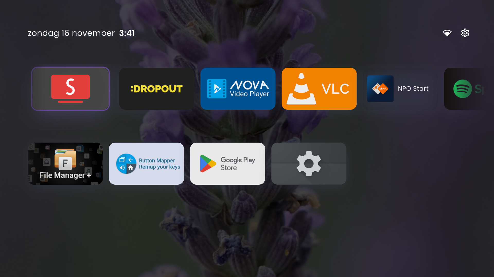
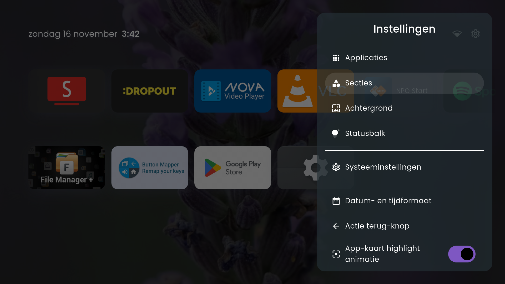
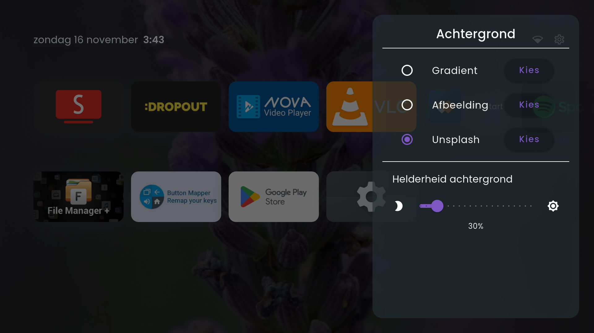
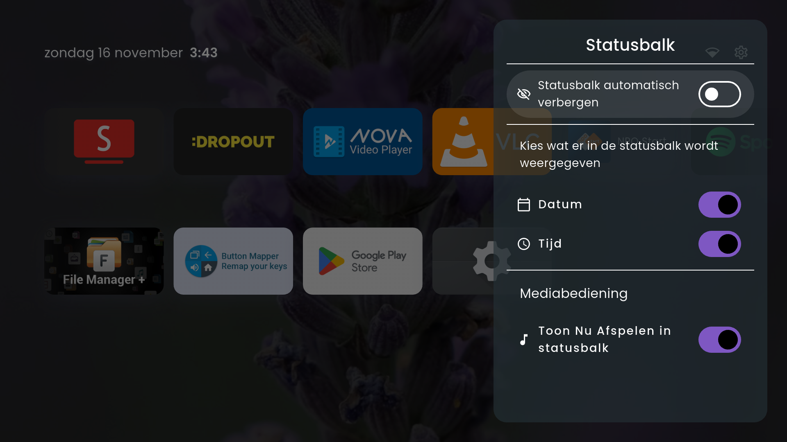

# FLauncher

A customizable, open-source Android TV launcher built with Flutter.

**Original project**: https://gitlab.com/flauncher/flauncher by [etienn01](https://github.com/etienn01)  
**This fork**: Enhanced with modern Flutter, improved UI/UX, and additional features.

## ⚠️ Disclaimer

**This fork is intended for private use only.** It is provided as-is with no guarantees, warranties, or support. Use at your own risk. Your mileage may vary (YMMV). The maintainer assumes no responsibility for any issues, damage, or malfunctions that may occur from using this software. Always backup your data and device settings before installation.

## Features

- **Customizable Categories**: Organize apps into rows or grids with custom names and layouts
- **Now Playing Widget**: Live media controls in the status bar
  - Play/pause control for active media sessions
  - Track information (artist, title, album)
  - Works with any app that uses Android MediaSession API (Spotify, YouTube Music, etc.)
  - Auto-hide when no media is playing
- **Wallpaper Management**: Built-in wallpaper system with support for:
  - Custom images (from device storage)
  - Gradient backgrounds
  - Unsplash integration for high-quality photos
- **TV-Optimized Navigation**: Designed for D-pad remotes with focus management and sound feedback
- **Status Bar Customization**:
  - Customizable date/time format
  - Network status indicator
  - Auto-hide top bar option
- **Back Button Actions**: Configure back button behavior (show clock, screensaver/ambient mode, or do nothing)
- **Multi-Language Support**: English, Spanish, Dutch
- **Material Design 3**: Modern Flutter UI with glass-morphism effects
- **Privacy-Focused**: No analytics or crash reporting

## Screenshots

|  |  |  |  |
|--|--|--|--|
|  |  |  |  |

## Development

### Prerequisites

- [mise](https://mise.jdx.dev/) - Development tool version manager

### Setup

1. Clone the repository
2. Install dependencies:
   ```bash
   mise install
   ```

3. Create `.env` file (for Unsplash integration):
   ```bash
   cp .env.example .env
   # Edit .env and add your Unsplash API key
   ```

### Available Commands

```bash
# Development build (installs as com.geert.flauncher.dev)
mise run run:dev

# Production build
mise run build

# Install production APK
mise run run:prod

# Uninstall development version
mise run clean:dev

# Bump version number
mise run bump
```

### Tech Stack

- **Flutter**: 3.38.1
- **Dart**: >=3.4.3
- **Java**: Zulu 23.32.11 (for Android builds)
- **Kotlin**: 1.9.0
- **Database**: SQLite with Drift ORM
- **State Management**: Provider pattern
- **Localization**: flutter_localizations with ARB files

## Installation on Android TV

### Method 1: Remap the Home Button (Recommended)

Use [Button Mapper](https://play.google.com/store/apps/details?id=flar2.homebutton) to remap your remote's Home button to launch FLauncher. This is the safest method.

### Method 2: Disable Default Launcher

**⚠️ WARNING: Proceed at your own risk. You are responsible for any device malfunctions.**

Tested on Chromecast with Google TV. Commands may differ on other devices.

#### Disable Default Launcher
```bash
# Disable the default launcher
adb shell pm disable-user --user 0 com.google.android.apps.tv.launcherx

# Disable the fallback component that re-enables the default launcher
adb shell pm disable-user --user 0 com.google.android.tungsten.setupwraith
```

After running these commands, press the Home button and select FLauncher as your default launcher.

#### Re-enable Default Launcher
```bash
adb shell pm enable com.google.android.apps.tv.launcherx
adb shell pm enable com.google.android.tungsten.setupwraith
```

#### Known Issues
On Chromecast with Google TV, the YouTube remote button may stop working after disabling the default launcher. Use [Button Mapper](https://play.google.com/store/apps/details?id=flar2.homebutton) to remap it.

## Usage

### Media Controls

The now playing widget appears automatically in the status bar when music or video is playing from apps that support Android MediaSession (Spotify, YouTube Music, Plex, etc.). Click the play/pause button to control playback directly from the launcher.

### Wallpapers

Android's `WallpaperManager` is not available on most Android TV devices, so FLauncher implements custom wallpaper management.

**Note**: To use custom image wallpapers, you need a file explorer app installed on your Android TV device.

### Settings

Access settings via the settings icon in the top-right corner. Available options:

- **Applications**: Show/hide apps, manage app visibility
- **Launcher Sections**: Create and manage app categories (rows/grids)
- **Wallpaper**: Choose gradient, custom image, or Unsplash photo
- **Status Bar**: Configure date/time format, network indicator, auto-hide behavior
- **Back Button**: Set action when pressing back in launcher
- **Navigation Sound**: Enable/disable D-pad navigation sounds

## Architecture

### Services (Provider-based State Management)

- **AppsService**: App discovery, categorization, and database operations
- **SettingsService**: User preferences and configuration
- **WallpaperService**: Wallpaper selection and persistence
- **NetworkService**: Network status monitoring
- **MediaService**: Media session monitoring and playback controls

### Database

- **ORM**: Drift (SQLite)
- **Schema Version**: 7 (with migration support)
- **Tables**: apps, categories, apps_categories, launcher_spacers

## Contributing

Contributions are welcome! Please ensure:

- Code follows Flutter/Dart conventions (runs `flutter analyze` without errors)
- New features include tests where appropriate
- Database changes include migration logic

## License

GNU General Public License v3.0

```
FLauncher
Copyright (C) 2021  Étienne Fesser

This program is free software: you can redistribute it and/or modify
it under the terms of the GNU General Public License as published by
the Free Software Foundation, either version 3 of the License, or
(at your option) any later version.
```

See [LICENSE](LICENSE) for full details.

## Credits

- **Original Author**: [Étienne Fesser (etienn01)](https://github.com/etienn01)
- **Original Repository**: https://gitlab.com/flauncher/flauncher
- **Fork Maintainer**: Geert van Dijk

### Support the Original Author

<a href="https://www.buymeacoffee.com/etienn01" target="_blank"></a>
